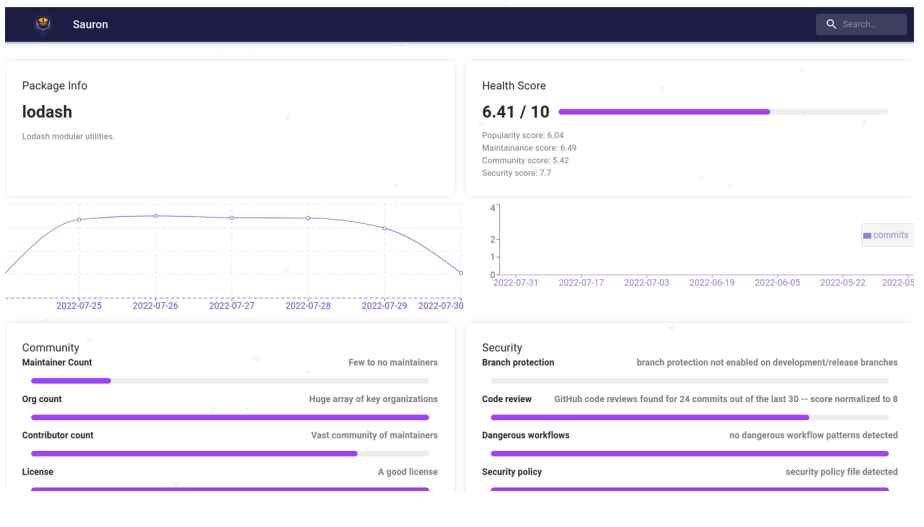
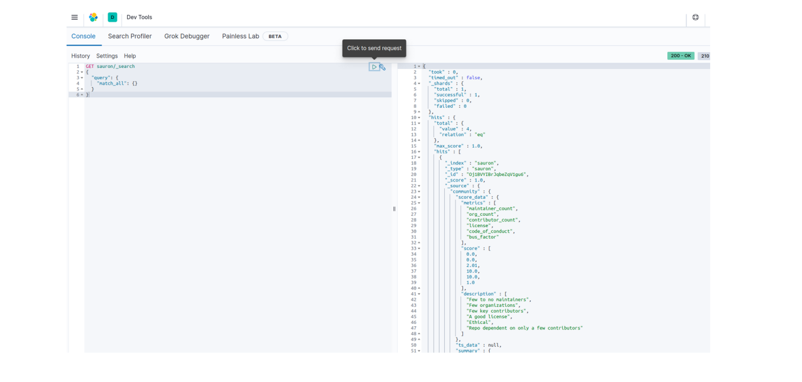
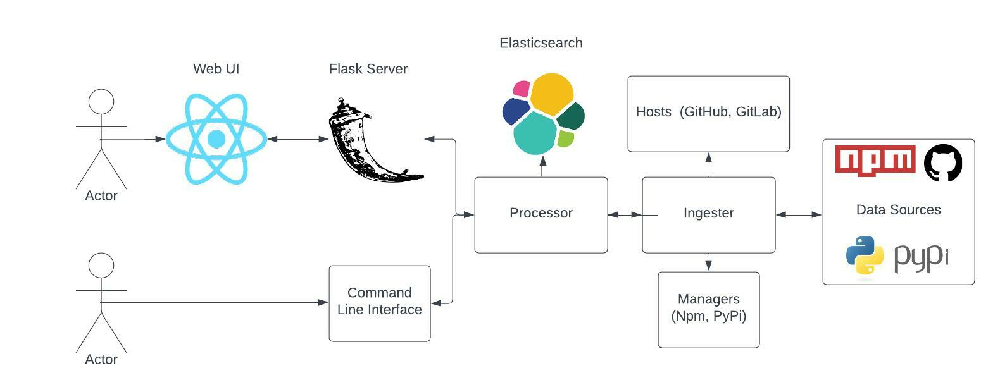
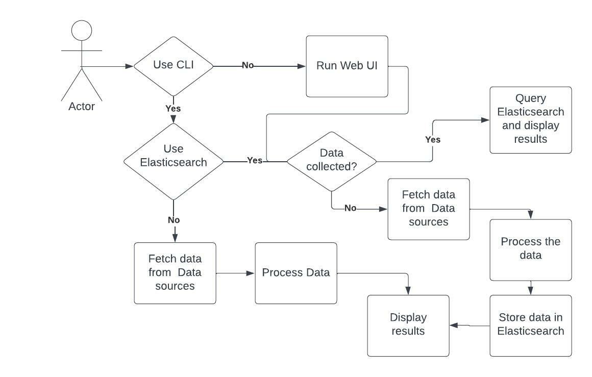

<p align='center'>

</p>

<h1>
<p align='center'>
Sauron - OSS Security Inspector 
</p>
</h1>

<p align='center'>

<a href="https://github.com/amal-thundiyil/sauron/blob/main/LICENSE"></a>

</p>

> "_One tool to rule them all, one tool to find them, One tool to bring them all, and in the darkness bind them._"

<h3>
<p align='center'>
🎥 Find Sauron's demo video <a href="https://youtu.be/R768ofGlLa4">here</a> 🎥
</p>
</h3>

## 📌 Introduction

Sauron is an easy way for consumers of open-source projects to judge whether their dependencies are really safe.

It is an automated tool that assesses a number of important heuristics associated with software security and assigns each check a score. You can use these scores to understand specific areas to improve in order to strengthen the security posture of your project. You can also assess the risks that dependencies introduce, and make informed decisions about accepting these risks, evaluating alternative solutions, or working with the maintainers to make improvements.

## 🤖 Installation

> 💡 You will need Python, Node and Docker to run the project successfully. You can install it simply by running:
>
> ```sh
> sudo apt install python3.8 python3.8-dev python3.8-venv python3-pip nodejs npm
> ```

From the project root folder run the following commands:

1. Setup a virtual environment to run the project in:

```sh
python3.8 -m venv venv
source venv/bin/activate
```

2. If you are going to use Elasticsearch (required for Web UI) then run the following command:

```sh
sudo sysctl -w vm.max_map_count=262144
docker-compose up
```

3. Install the developer dependencies:

```sh
make install-dev
```

3. Start the backend Flask server

```sh
make backend-start
```

4. Start the frontend React application

```sh
make frontend-start
```

Setup the `sauron.config.json` configuration file with the configuration values. You can refer to `sauron.example.json` for details.

## 👨‍💻️ Usage

### Sauron CLI

```sh
$ sauron check --url "https://github.com/amal-thundiyil/moni-moni"

███████╗ █████╗ ██╗   ██╗██████╗  ██████╗ ███╗   ██╗
██╔════╝██╔══██╗██║   ██║██╔══██╗██╔═══██╗████╗  ██║
███████╗███████║██║   ██║██████╔╝██║   ██║██╔██╗ ██║
╚════██║██╔══██║██║   ██║██╔══██╗██║   ██║██║╚██╗██║
███████║██║  ██║╚██████╔╝██║  ██║╚██████╔╝██║ ╚████║
╚══════╝╚═╝  ╚═╝ ╚═════╝ ╚═╝  ╚═╝ ╚═════╝ ╚═╝  ╚═══╝

🧐 Running all checks
🌏  Analyzing community
✔️  Completed community analysis
📈️  Analyzing popularity
✔️  Completed popularity analysis
🛠️  Analyzing maintainence
✔️  Completed maintainence analysis
🛡️  Analyzing security
✔️  Completed security analysis


╒══════════════╤═════════╤══════════════════════════════════╕
│ Metrics      │   Score │ Description                      │
╞══════════════╪═════════╪══════════════════════════════════╡
│ Community    │    2.37 │ Inactive community               │
├──────────────┼─────────┼──────────────────────────────────┤
│ Popularity   │    0.57 │ Repo is not very popular         │
├──────────────┼─────────┼──────────────────────────────────┤
│ Maintainence │    3.4  │ Repo is dormant                  │
├──────────────┼─────────┼──────────────────────────────────┤
│ Security     │    5.3  │ Repo is secure with few problems │
╘══════════════╧═════════╧══════════════════════════════════╛


🚩 Aggregate score: 2.91
📜 Aggregate summary: Community is dormant. Repo is dormant. Some downloads and interaction. Security can be improved upon
``
```

You can run `--help` to see the different CLI commands and options.

```sh
$ sauron check --help
Usage: sauron check [OPTIONS]

  Run security and health checks of Open source software

Options:
  -u, --url TEXT            URL of the package to analyze
  -n, --name TEXT           Name of package to analyze. For GitHub enter
                            <organization>/<repository>
  --type [github|npm|pypi]  Type of package to analyze
  -t, --token TEXT          API token to increase rate limit.
  --community               Run community checks
  --maintainence            Run maintainence checks
  --security                Run security checks
  --popularity              Run popularity checks
  --threshold FLOAT         Minimum score required to pass
  --elastic                 Use Sauron CLI with Elasticsearch.
  --help                    Show this message and exit.

$ sauron db --help
Usage: sauron db [OPTIONS] COMMAND [ARGS]...

  Manage the Elasticsearch database

Options:
  --help  Show this message and exit.

Commands:
  add-repo
  drop
  get-repo
```

### Sauron Web UI

<p align='center'>
React Application
</p>

<p align='center'>

</p>

<p align='center'>
Kibana Interface
</p>

<p align='center'>

</p>

## 🎓 Description

- User Story: How do I know if the package/repository I am using is safe?
- Solution: Ingest, clean, and processes the data available on the code hosting and package manager platforms to derive meaningful insights.
- Better security posture with cross-platform CLI tool and adoption of Shift-Left Security to incorporate security and testing into the development phase as early as possible.
- Assesses a number of important heuristics associated with software security and assigns each check a score.
- Sauron tracks four major metrics as shown in the diagram to produce a final score out of 10.

<p align='center'>
 <b>Architecture Diagram</b>
</p>

<p align='center'>

</p>

<p align='center'>
 <b>Workflow</b>
</p>

<p align='center'>

</p>

Data processing is done by giving weights and thresholds to different parameters, tuned according to popular repositories and publicly defined metrics. More info in `docs/metrics.md`.

### Limitations

- Takes time to process and present data on the first try.
- Rate limit and speed of vendor APIs to source the data are a concern.
- Limited to few popular platforms which contribute to the majority of publically available repositories.

### Future Scope

- [ ] Adding monetization in the form of actionable steps to improve package health.
- [ ] Could be expanded to work on the security of cloud infrastructure, other package managers, and source code hosting platforms.
- [ ] Seamless integrations into developer tooling, workflows, and automation pipelines.
