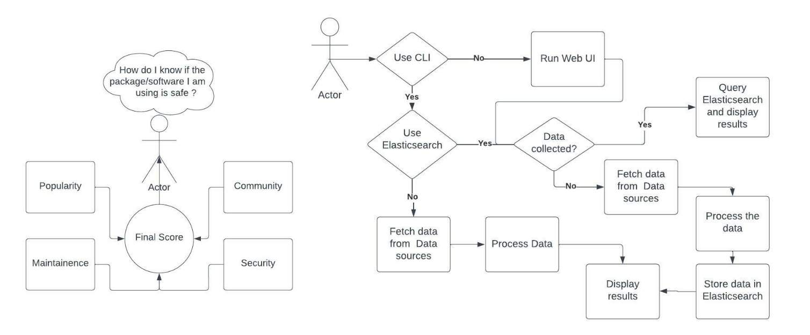

[](https://github.com/amal-thundiyil/vigil/actions/workflows/ci.yml) 
[](https://github.com/amal-thundiyil/vigil/actions/workflows/cd.yml) 
[](https://github.com/amal-thundiyil/vigil/blob/main/LICENSE) 

# Vigil 🧐

Vigil is an easy way for consumers of open-source projects to judge whether their dependencies are really safe.

It is an automated tool that assesses a number of important heuristics associated with software security and assigns each check a score. You can use these scores to understand specific areas to improve in order to strengthen the security posture of your project. You can also assess the risks that dependencies introduce, and make informed decisions about accepting these risks, evaluating alternative solutions, or working with the maintainers to make improvements.

```sh
$ vigil check --url "https://github.com/amal-thundiyil/moni-moni"

██╗   ██╗██╗ ██████╗ ██╗██╗     
██║   ██║██║██╔════╝ ██║██║     
██║   ██║██║██║  ███╗██║██║     
╚██╗ ██╔╝██║██║   ██║██║██║     
 ╚████╔╝ ██║╚██████╔╝██║███████╗
  ╚═══╝  ╚═╝ ╚═════╝ ╚═╝╚══════╝

🧐 Running all checks
🌏  Analyzing community
✔️  Completed community analysis
📈️  Analyzing popularity
✔️  Completed popularity analysis
🛠️  Analyzing maintainence
✔️  Completed maintainence analysis
🛡️  Analyzing security
✔️  Completed security analysis


╒══════════════╤═════════╤══════════════════════════════════╕
│ Metrics      │   Score │ Description                      │
╞══════════════╪═════════╪══════════════════════════════════╡
│ Community    │    2.37 │ Inactive community               │
├──────────────┼─────────┼──────────────────────────────────┤
│ Popularity   │    0.57 │ Repo is not very popular         │
├──────────────┼─────────┼──────────────────────────────────┤
│ Maintainence │    3.4  │ Repo is dormant                  │
├──────────────┼─────────┼──────────────────────────────────┤
│ Security     │    5.3  │ Repo is secure with few problems │
╘══════════════╧═════════╧══════════════════════════════════╛


🚩 Aggregate score: 2.91
📜 Aggregate summary: Community is dormant. Repo is dormant. Some downloads and interaction. Security can be improved upon
```

You can run `--help` to see the different CLI commands and options.


## Description

- User Story: How do I know if the package/repository I am using is safe?
- Solution: Ingest, clean, and processes the data available on the code hosting and package manager platforms to derive meaningful insights.
- Better security posture with cross-platform CLI tool and adoption of Shift-Left Security to incorporate security and testing into the development phase as early as possible.
- Assesses a number of important heuristics associated with software security and assigns each check a score.
- Vigil tracks four major metrics as shown in the diagram to produce a final score out of 10.

<p align='center'>
 <b>Architecture Diagram</b>
</p>

<p align='center'>

</p>

<p align='center'>
 <b>Workflow</b>
</p>

<p align='center'>

</p>

Data processing is done by giving weights and thresholds to different parameters, tuned according to popular repositories and publicly defined metrics. More info [here](docs/metrics.md).

## Contributing 

For information on how to contribute to this project, please refer to the [Contributing Guidelines](.github/CONTRIBUTING.md).

## License

This project is licensed under the [MIT License](./LICENSE). Please review the license before using or contributing to the project.
